# 充电桩微信小程序（可交付演示版）

[](https://github.com/Hongz-return/-/actions/workflows/ci.yml)


一个**纯前端**的「充电桩」微信小程序 Demo：找站 → 选枪 → 扫码/手动启动 → 实时充电 → 结算支付 → 订单归档。
所有数据来自本地 mock 与 `wx.setStorageSync`，**不依赖任何后端服务、不引入任何 npm 运行时依赖**，用微信开发者工具的**测试号**即可直接导入运行。

```
首页                  订单               我的
├─ 搜索/筛选/排序     ├─ 全部/充电中     ├─ 用户信息 + 钱包
├─ 列表 / 地图双视图  ├─ 待支付/已完成   ├─ 收藏 / 优惠券 / 发票
├─ 扫码充电           └─ 订单详情账单    ├─ 演示说明与隐私
└─ 进行中充电悬浮条                      └─ 清除本地数据
```

> ### 演示声明
>
> 这是一个**演示版**小程序，用于展示完整的充电桩业务流程：
>
> - **不产生真实充电、不产生真实扣款**：充电按 60 倍速仿真，支付为本地 mock，不对接任何支付通道。
> - **不采集、不上传任何个人信息**：没有登录、没有后端接口，运行期间不发起任何网络请求，断网也能完整体验。
> - **数据只保存在本机**：订单、钱包流水、收藏、优惠券、发票记录都写入小程序本地 Storage，
>   可在「我的 → 清除本地数据」一键删除。
>
> 同样的声明在小程序内也能看到：首页首次进入的一次性提示条、「我的」页常驻声明卡片，
> 以及「我的 → 演示说明与隐私」（`pages/about`）。

---

## 一、快速开始

1. 安装 [微信开发者工具](https://developers.weixin.qq.com/miniprogram/dev/devtools/download.html)（稳定版即可）。
2. 打开工具 → **导入项目** → 目录选择本仓库根目录。
3. AppID 选择 **测试号**（仓库已配置 `touristappid`，无需注册小程序账号）。
4. 点击「编译」，模拟器中即可体验完整流程。

> 项目已在 `project.config.json` 的 `condition` 中预置了 8 个编译模式（首页、站点详情、扫码进入、订单、
> 我的、钱包、发票管理、演示说明），可在工具右上角「普通编译」下拉框中直接切换到指定页面调试。
> `packOptions.ignore` 已排除 `tests/`、`tools/`、`docs/`、`.github/` 等仅用于开发的目录，不会打进小程序包。

### 5 分钟演示路径（建议按此顺序走查）

| 步骤 | 操作 | 预期结果 |
| --- | --- | --- |
| 1 | 首页首次进入 | 顶部出现一次性演示声明提示条，点「✕」后不再出现（状态存本机） |
| 2 | 搜索「超充」，切换筛选「有空闲」、排序「价格最低」 | 列表实时过滤与重排 |
| 3 | 点击右上角「地图」 | 切换到地图视图，点击绿色 marker 弹出站点卡片 |
| 4 | 点击「扫码」→ 确认「模拟扫码」 | 随机命中一个空闲枪并跳转到对应站点详情 |
| 5 | 详情页查看分时电价，选择一把空闲枪 → 开始充电 | 二次确认弹窗 → 启动动画 → 进入充电页；该枪状态变为「使用中」 |
| 6 | 观察充电页 | SOC 环形进度、时长、实时功率、费用每秒刷新（60 倍速） |
| 7 | 返回首页/订单页 | 底部出现绿色「充电中」悬浮条，订单 tab 出现红点 |
| 8 | 回到充电页 → 结束充电 | 进入结算页：明细 + 自动匹配优惠券 + 支付方式 |
| 9 | 结算页尝试左滑/点返回 | 弹窗提示订单会保留在「待支付」，避免误离开结算 |
| 10 | 选择「余额支付」→ 确认支付（可连点验证不会重复扣款） | 支付成功页；钱包余额扣减一次、优惠券核销、充电枪恢复空闲 |
| 11 | 订单 tab | 订单状态变为「已完成」，可查看账单详情、删除、再来一次 |
| 12 | 订单详情 → 申请开票 | 进入发票管理页并预选该订单，填写抬头后提交，生成本地开票记录 |
| 13 | 我的 → 钱包 → 充值 100 元 | 余额增加并生成交易流水 |
| 14 | 我的 → 演示说明与隐私 | 演示边界、本机数据清单、客服信息与分享按钮 |
| 15 | 开发者工具切到「无网络」 | 提示「当前无网络，演示版可离线使用」，所有流程照常可用 |
| 16 | 我的 → 清除本地数据 | 恢复到初始演示状态（含 2 条示例历史订单） |

---

## 二、功能清单

### 核心功能

| 模块 | 能力 |
| --- | --- |
| **TabBar** | 首页 / 订单 / 我的 三个主入口，进行中或待支付订单时「订单」tab 显示红点 |
| **首页** | 关键词搜索（站名 / 地址 / 运营商 / 标签）、5 种筛选（全部/快充/慢充/有空闲/收藏）、4 种排序（距离/价格/空闲/功率）、下拉刷新 |
| **地图模式** | 一键切换列表 / 地图；8 个站点按真实经纬度打点，空闲站绿色 marker、无空闲站灰色 marker；点击 marker 弹出站点卡片；一键回到当前位置 |
| **扫码充电** | 调用 `wx.scanCode`，支持 3 种二维码格式；开发者工具无摄像头时提供「模拟扫码」兜底，直达对应站点并预选该枪 |
| **站点详情** | 站点信息、分时电价（谷/平/峰）、充电枪宫格（按快慢充筛选、状态实时）、收藏、导航（`wx.openLocation`）、复制地址、客服 |
| **充电流程** | SOC 环形进度、已充时长/实时功率/当前费用、充电曲线仿真（80% 后进入涓流）、充满自动结束 |
| **支付流程** | 结束充电 → 结算页（费用明细 + 自动匹配最优优惠券 + 余额/微信支付）→ 支付成功页；余额不足会引导充值 |
| **订单** | 全部/充电中/待支付/已完成四类；汇总累计订单数、电量、消费；支持继续充电、去支付、再来一次、删除 |
| **订单详情** | 完整账单（电费/服务费/优惠/实付）、SOC 变化、订单进度时间线、复制订单号、申请开票 |
| **发票管理** | 勾选已完成订单（支持全选）、个人/企业抬头、税号与邮箱校验、提交后生成本地开票记录并可查历史 |
| **我的** | 用户信息（可改车牌）、钱包余额、优惠券/收藏/发票数量、充电统计、常用功能入口、一键清除本地数据 |
| **钱包** | 余额展示、5 档快捷金额 + 自定义金额充值、交易流水（充值/余额支付/微信支付） |
| **收藏 / 优惠券** | 收藏站点列表与取消收藏；优惠券可用/已使用分类 |
| **演示说明与隐私** | 演示边界与隐私声明、本机 Storage 数据清单、已知限制、客服入口、分享按钮 |

### 体验与质量

- **统一设计系统**：`app.wxss` 集中定义主题色、间距、圆角、卡片、按钮、标签、空态、骨架屏，页面只复用不重复定义。
- **加载态**：首页、详情、订单、收藏页均有骨架屏（`components/skeleton`）。
- **空状态**：所有列表页使用统一空态组件（`components/empty`），带图标、说明与引导按钮。
- **交互反馈**：关键操作（开始充电、结束充电、支付、充值、删除、清除数据）均有 `showModal` 二次确认与 `showToast` / `showLoading` 反馈。
- **全局感知**：`components/charging-bar` 悬浮条在首页/订单/我的/详情页展示进行中的充电，点击直达充电页。
- **数据一致性**：开始充电占用枪位、结束充电释放枪位，状态持久化到 Storage，列表与详情页立即可见。
- **无图标字体、无表情符号**：界面图标由 `app.wxss` 中的纯 CSS 图标系统（`.ic-*`，伪元素拼几何图形）绘制，
  跟随字号与 `currentColor` 缩放着色，不依赖图片或 emoji。
- **纯前端健壮性**：Storage 数据被外部破坏时读接口过滤脏数据并回落到可用默认值；
  重复点击「确认支付」只扣款一次；结算阶段离开页面会二次确认；断网时给出「无需联网」提示。

---

## 三、页面截图

下面的 12 张图**不是手工截图，也不是手绘线框图**，而是由脚本从仓库源码生成的：

```bash
npm run docs   # = npm run preview && npm run screenshots
```

1. `npm run preview` 用 `tests/helpers/miniprogram.js` 的小程序运行时模拟器**真实执行页面生命周期**
   拿到页面数据，再由 `tools/lib/wxml.js` / `tools/lib/wxss.js` 把真实的 WXML + WXSS 渲染成
   静态预览页 `docs/preview/index.html`（可直接用浏览器打开逐屏点看）。
2. `npm run screenshots` 用本机 Chrome 无头模式对预览页逐屏截图，输出 750×1624（375×812 @2x）PNG。

因此图里的价格、电量、订单号、SOC、余额都是业务代码算出来的真实结果。生成时时间与随机数被固定
（`2026-08-25 14:30`，`Asia/Shanghai`），重跑得到字节一致的产物，CI 会校验这一点。

| 首页列表 | 首页地图 | 站点详情 |
| --- | --- | --- |
|  | 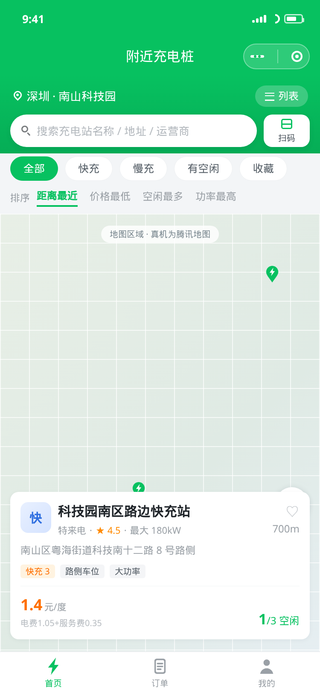 | 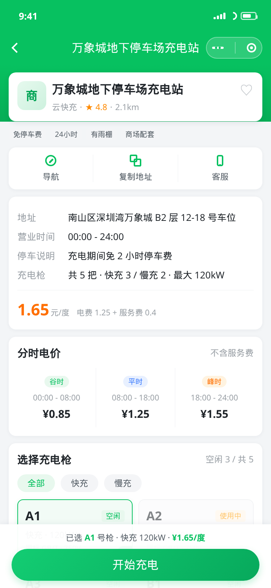 |
| 搜索 / 筛选 / 排序 / 站点卡片 / 演示声明条 | marker 打点与选中站点预览卡片 | 分时电价 / 充电枪宫格 / 已选枪底栏 |

| 充电中 | 订单结算 | 支付成功 |
| --- | --- | --- |
| 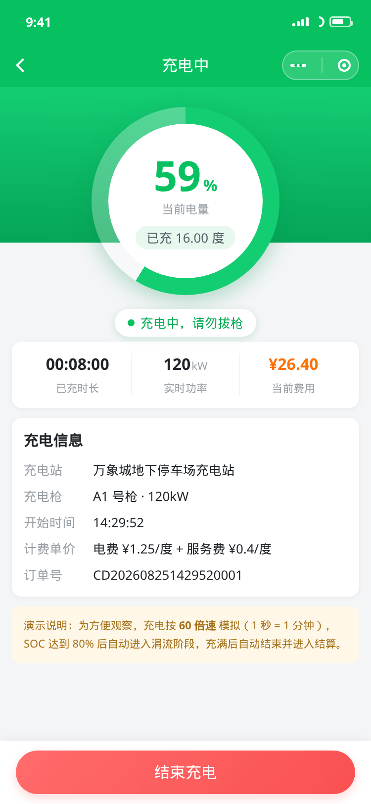 | 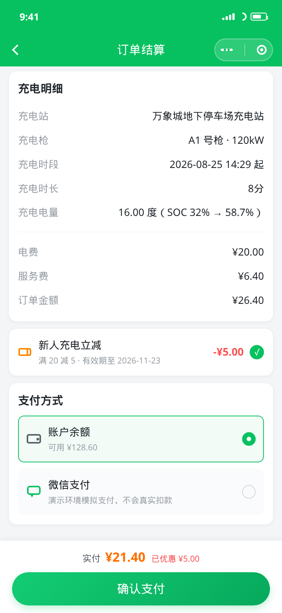 | 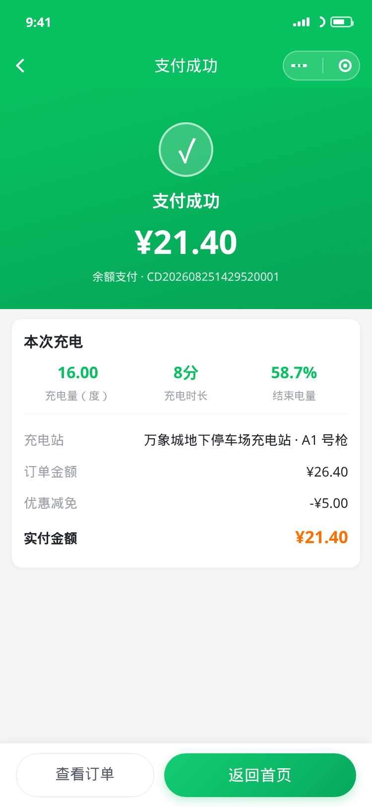 |
| SOC 环形进度与实时功率、电量、费用 | 费用明细 / 优惠券 / 支付方式 | 本次充电汇总与实付明细 |

| 订单列表 | 订单详情 | 我的 |
| --- | --- | --- |
| 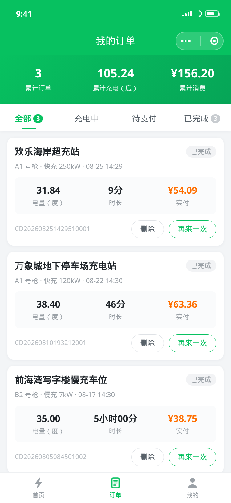 | 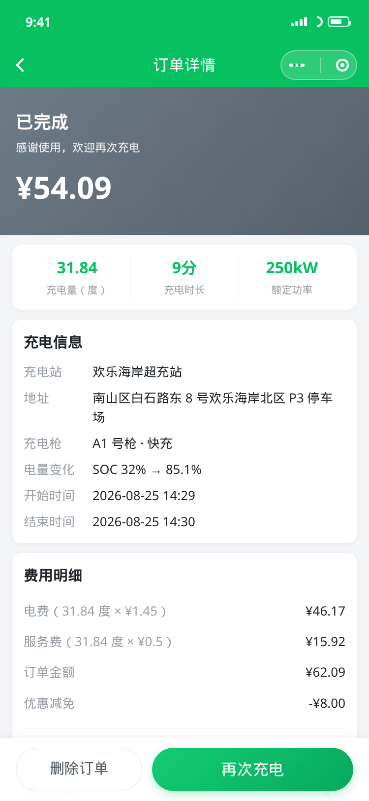 | 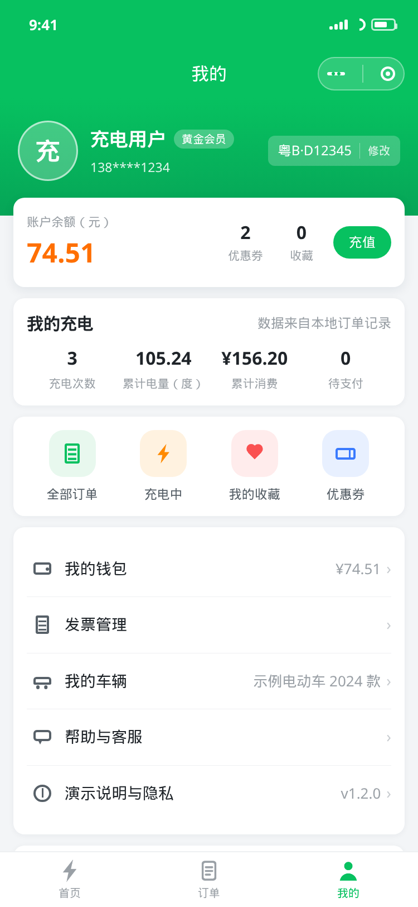 |
| 状态分类、累计统计与订单操作 | 完整账单与订单进度时间线 | 钱包 / 充电统计 / 功能入口 |

| 钱包 | 发票管理 | 演示说明与隐私 |
| --- | --- | --- |
| 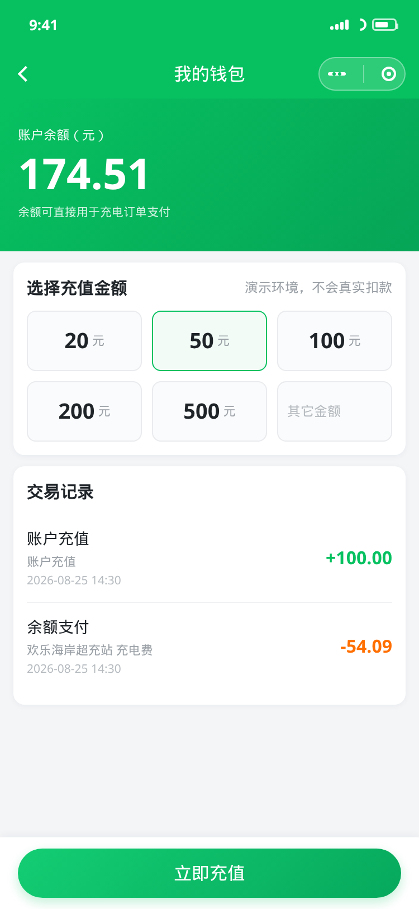 | 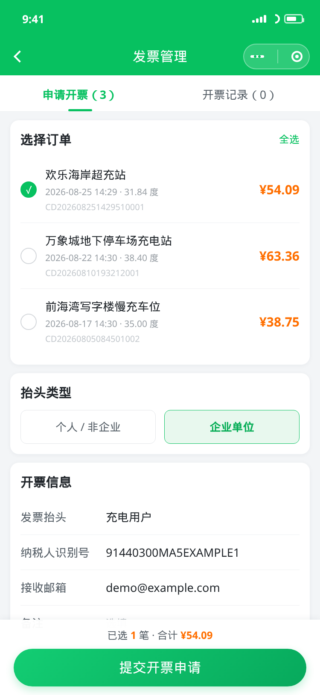 | 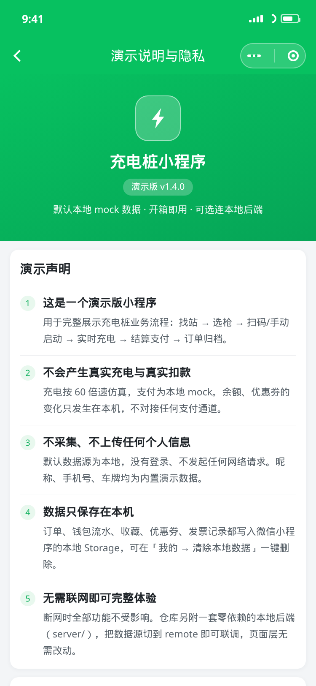 |
| 快捷金额充值与交易流水 | 选择订单、填写抬头并提交开票 | 演示边界、本机数据清单、客服 |

> 地图与原生输入框依赖客户端能力，预览渲染中以等价占位呈现（地图为网格底图 + 真实 marker 图标
> 按经纬度定位，输入框渲染为带占位文案的容器），其余布局与真机一致。
> 说明详见 [`docs/preview/README.md`](docs/preview/README.md) 与 [`docs/screenshots/README.md`](docs/screenshots/README.md)。

---

## 四、目录结构

```
├── app.js                     # 全局逻辑：演示数据播种、会话同步、tabBar 红点、网络状态提示
├── app.json                   # 页面注册、window、tabBar 配置
├── app.wxss                   # 全局设计系统（主题色/卡片/按钮/标签/空态/骨架屏 + CSS 图标系统）
├── project.config.json        # 开发者工具项目配置（测试号 + 编译模式 + 打包忽略）
├── sitemap.json
├── package.json               # 仅用于本地校验/测试脚本，小程序运行时不依赖
├── LICENSE                    # MIT
├── CHANGELOG.md               # 版本变更记录
├── .github/workflows/ci.yml   # CI：Node 18/20/22 跑 npm run check + 生成物一致性校验
│
├── assets/
│   ├── tabbar/                # tabBar 图标（由 tools/gen-assets.js 生成）
│   └── marker/                # 地图 marker 图标
│
├── components/
│   ├── station-card/          # 充电站卡片（首页 / 收藏 / 地图预览复用）
│   ├── charging-bar/          # 全局「充电进行中」悬浮条
│   ├── empty/                 # 统一空状态
│   └── skeleton/              # 列表骨架屏
│
├── pages/
│   ├── index/                 # 首页：搜索 / 筛选 / 排序 / 地图 / 扫码
│   ├── detail/                # 站点详情：信息 / 电价 / 选枪 / 启动
│   ├── charging/              # 充电中 → 结算 → 支付成功（三阶段同页）
│   ├── orders/                # 订单列表（tabBar）
│   ├── order-detail/          # 订单详情账单
│   ├── mine/                  # 我的（tabBar）
│   ├── wallet/                # 钱包与充值
│   ├── favorites/             # 我的收藏
│   ├── coupons/               # 优惠券
│   ├── invoice/               # 发票管理：选单 / 填抬头 / 开票记录
│   └── about/                 # 演示说明与隐私、本机数据清单、客服、分享
│
├── utils/
│   ├── mock.js                # 站点/充电枪 mock 数据、搜索排序、扫码解析、marker
│   ├── storage.js             # Storage 封装：订单/钱包/收藏/优惠券/会话/枪状态/发票
│   ├── charging.js            # 充电领域逻辑：开始/进度推算/结束/支付
│   ├── format.js              # 时间、金额、电量、距离、订单号格式化
│   └── config.js              # 版本号、客服信息、演示声明文案（集中一处）
│
├── tools/
│   ├── gen-assets.js          # 以纯 Node（zlib）矢量绘制并导出 PNG 图标
│   ├── gen-preview.js         # 渲染真实 WXML/WXSS 为 docs/preview 静态预览页
│   ├── gen-screenshots.js     # 用本机 Chrome 对预览页逐屏截图到 docs/screenshots
│   ├── lib/wxml.js            # WXML 解析与渲染（{{}}、wx:if、wx:for、自定义组件内联）
│   ├── lib/wxss.js            # WXSS → 作用域化 CSS（rpx→px、100vh、选择器加前缀）
│   └── validate.js            # 工程静态校验（JSON/JS/页面四件套/组件/WXML/资源）
│
├── docs/
│   ├── preview/               # 生成物：可在浏览器打开的静态预览页
│   └── screenshots/           # 生成物：12 张 750×1624 界面图（README 引用）
│
└── tests/                     # node:test 测试（67 个用例）
    ├── helpers/miniprogram.js  # 小程序运行时模拟器（wx.* 存根 + App/Page/Component）
    ├── format.test.js
    ├── storage.test.js
    ├── mock.test.js
    ├── charging.test.js
    └── pages.test.js          # 11 个页面 + 3 个组件的生命周期与交互冒烟测试
```

---

## 五、数据与持久化

所有业务数据通过 `utils/storage.js` 统一读写，Storage Key 一览：

| Key | 内容 |
| --- | --- |
| `cp_orders` | 订单数组（最多保留 100 条，按开始时间倒序） |
| `cp_order_seq` | 订单号自增序列 |
| `cp_charging_session` | 进行中的充电会话（重启小程序后可恢复） |
| `cp_wallet` | 钱包余额与交易流水（最多 50 条） |
| `cp_user` | 用户资料（昵称、手机号、车牌等） |
| `cp_favorites` | 收藏站点 id 列表 |
| `cp_coupons` | 优惠券列表与核销状态 |
| `cp_pile_status` | 充电枪实时状态覆盖表 `{ stationId: { pileId: status } }` |
| `cp_invoices` | 开票记录（按订单去重，倒序） |
| `cp_seeded` | 首次启动播种示例历史订单的标记 |
| `cp_notice_dismissed` | 首页演示声明提示条是否已关闭 |

以上就是本 Demo 在设备上写入的**全部**数据，「我的 → 清除本地数据」会一次性删除；
小程序内的「我的 → 演示说明与隐私」页同样列出了这份清单。

`utils/storage.js` 的所有 `wx.*` 调用都是**惰性解析**的：检测不到 `wx` 时自动回落到等价的内存实现（读写做深拷贝，与 Storage 的序列化语义一致）。
因此 `storage.js`、`mock.js`、`charging.js`、`format.js` 可以在 Node 中直接 `require` 并做单元测试，业务逻辑与小程序运行时完全一致。

读接口对**损坏数据**做了兜底：数组类 Key 拿到非数组时返回空数组，订单/优惠券/流水里的非法元素被过滤，
钱包结构不可用时重建默认值、`balance` 为 `NaN` 或负数时回落到 0。所以手动改坏 Storage 也不会让页面白屏。

### Mock 数据

`utils/mock.js` 内置 **8 个充电站**，每站包含：名称、地址、经纬度、运营商、评分、营业时间、停车说明、电费/服务费单价、标签、主题色、分时电价（谷/平/峰），以及 2–5 把充电枪（编号、快/慢充、功率、接口标准、电压、状态）。

- 充电枪状态：`idle` 空闲 / `busy` 使用中 / `offline` 维护中。
- 距离由 Haversine 公式根据模拟用户位置（深圳南山科技园 `22.535, 113.942`）实时计算，与地图 marker 位置一致。
- 静态数据与 `cp_pile_status` 覆盖表合并后对外输出，因此**开始充电会立刻把该枪标为使用中，结束充电后恢复空闲**。

### 扫码二维码格式

`mock.resolveScanCode(code)` 支持三种内容，命中后返回 `{ stationId, pileId }`：

```
chargingpile://station/st-001/pile/p-001-a1      # 自定义 scheme
https://example.com/charge?station=st-001&pile=p-001-a1   # URL 查询参数
p-001-a1                                          # 直接是充电枪编号
```

站点存在但枪号非法时会退化为只定位到站点；完全无法识别时提示「不是本平台的二维码」。

---

## 六、充电与计费模型

充电页按 **60 倍速**模拟（1 秒真实时间 = 60 秒充电时间），便于快速看到完整流程。倍率见 `utils/charging.js` 的 `SIM_SPEED`（设为 `1` 即真实速度）。

模拟电池：容量 `60 kWh`，起始 SOC `32%`。充电曲线分两段（贴近真实车辆表现）：

```
SOC ≤ 80%   : 功率 = 充电枪额定功率
SOC > 80%   : 功率 = 额定功率 × 0.35   （涓流阶段）
SOC = 100%  : 功率 = 0，自动结束充电并进入结算

电量(度)  = Σ 功率(kW) × 时长(h)
电费      = 电量 × 电费单价
服务费    = 电量 × 服务费单价
订单金额  = 电费 + 服务费
实付金额  = 订单金额 − 优惠券面额（不小于 0）
```

优惠券在结算时**自动匹配门槛内面额最大的一张**，可手动取消使用；支付成功后核销。

---

## 七、开发者命令

无需 `npm install`（没有任何依赖），Node ≥ 18 即可：

```bash
npm run validate      # 工程静态校验：JSON / JS 语法 / 页面四件套 / 组件引用 / WXML / 静态资源
npm test              # 运行 67 个测试用例
npm run check         # 上面两项一起跑（CI 跑的就是这个）
npm run assets        # 重新生成 tabBar 与 marker 图标（改图标只需改 tools/gen-assets.js）
npm run preview       # 重新生成 docs/preview 静态预览页
npm run screenshots   # 用本机 Chrome 重新截图到 docs/screenshots（需要本机有 Chrome）
npm run docs          # preview + screenshots
npm run build:assets  # assets + preview（CI 用它校验生成物是否与仓库一致）
```

### 持续集成

`.github/workflows/ci.yml` 在每次 push 与 PR 上跑两个 job：

| Job | 内容 |
| --- | --- |
| `check` | 在 Node 18 / 20 / 22 三个版本上跑 `npm run check` |
| `assets` | 重跑 `npm run build:assets`，若生成物与仓库内容有 diff 则失败，保证提交的图标与预览页没有过期 |

`tools/validate.js` 会检查：

1. 全部 `.json` 文件 JSON 合法；
2. 全部 `.js` 文件通过 `node --check` 语法检查；
3. `app.json` 注册的每个页面 `js/json/wxml/wxss` 四件套齐全；
4. 所有 `usingComponents` 指向的组件文件存在且声明了 `"component": true`；
5. tabBar 图标、`sitemap.json`、代码中引用的 `/assets/**` 资源均存在；
6. 所有 `.wxml` 标签正确闭合，且 `bindtap` / `catchtap` 等绑定的处理函数在对应 `.js` 中确实有定义。

### 测试覆盖

单元测试直接跑真实业务代码；页面测试则在 `tests/helpers/miniprogram.js` 提供的**小程序运行时模拟器**
（wx.* 存根 + App/Page/Component/getApp）中执行页面的生命周期与事件处理函数，因此能在没有微信开发者工具的
环境里跑通「找站 → 选枪 → 充电 → 结算 → 支付 → 订单」完整闭环。

| 测试文件 | 用例 | 覆盖内容 |
| --- | --- | --- |
| `tests/format.test.js` | 7 | 时长/金额/电量/距离/日期格式化、手机号打码、订单号生成 |
| `tests/storage.test.js` | 15 | 用户资料、钱包充值与支付（含余额不足）、订单增删改查与统计、收藏、枪状态覆盖表、会话、优惠券挑选与核销、开票记录去重、**损坏数据兜底与脏数据过滤**、重置 |
| `tests/mock.test.js` | 11 | 站点字段完整性与排序、关键词搜索、筛选、枪状态覆盖生效、marker 生成、扫码解析（含非法输入）、Haversine 距离 |
| `tests/charging.test.js` | 14 | 开始充电占枪与建单、重复开单拦截、恒功率/涓流/充满三段曲线、结束充电放枪、余额/微信支付、优惠券抵扣、余额不足、**重复支付不重复扣款**、**优惠券只核销一次**、完整闭环 |
| `tests/pages.test.js` | 20 | 11 个页面 + 3 个组件的生命周期与交互：搜索/筛选/排序/地图/扫码、选枪与启动、充电结算支付、订单增删、我的与钱包、收藏与优惠券、**开票校验与提交**、**演示声明页与 storage 清单一致性**、**断网提示** |

合计 **67 个用例，全部通过**，在 Node 18 / 20 / 22 上结果一致。

> `npm test` 用的是不带参数的 `node --test`（由测试运行器自己递归发现 `*.test.js`）。
> 不要改成 `node --test "tests/*.test.js"`：`--test` 参数里的 glob 展开要 Node 21+ 才支持，
> Node 18 / 20 会把它当成字面路径而报 `Could not find`；而 `node --test tests/` 反过来在 Node 22 上失败。

---

## 八、交付清单

| 项目 | 状态 |
| --- | --- |
| 底部 TabBar（首页 / 订单 / 我的） | ✅ |
| 订单页：历史记录 + Storage 持久化 + 账单详情 | ✅ |
| 我的页：用户信息 / 余额钱包 / 常用功能入口 | ✅ |
| 首页按站名、地址、运营商搜索 | ✅ |
| 列表 / 地图视图切换 + marker 标注 | ✅ |
| 扫码充电（含无摄像头兜底） | ✅ |
| 结束充电后的确认支付流程 + 支付成功写入订单 | ✅ |
| 充电中状态全局感知（悬浮条 + tabBar 红点） | ✅ |
| Mock 数据补充经纬度等字段，充电结束更新枪状态 | ✅ |
| 统一设计系统（主题色/间距/卡片/空态/加载态/反馈） | ✅ |
| 各页面 empty / loading 状态 | ✅ |
| 代码结构分层（format / storage / charging / mock + 4 个组件） | ✅ |
| `app.json` tabBar 与路由配置 | ✅ |
| `project.config.json` 测试号可直接导入 | ✅ |
| README 完整文档 | ✅ |
| JSON 合法性 + JS 语法 + WXML 校验脚本 | ✅ |
| 单元测试 + 页面级冒烟测试 | ✅ 67 个用例 |
| GitHub Actions CI（Node 18/20/22 + 生成物一致性） | ✅ |
| `LICENSE`（MIT，与 `package.json` 一致） | ✅ |
| `CHANGELOG.md` | ✅ |
| 界面图（脚本生成，README 可直接显示） | ✅ 12 张 |
| 静态预览页（浏览器直接打开看布局） | ✅ `docs/preview/index.html` |
| 演示 / 隐私声明（首页轻提示 + 我的常驻卡片 + 独立说明页 + README） | ✅ |
| 「申请开票」由 toast 提升为可用页面 | ✅ `pages/invoice` |
| 界面无装饰性 emoji（改为纯 CSS 图标 + 中文文案） | ✅ |
| 边界处理（Storage 损坏、重复支付、结算防误返回、断网声明） | ✅ |
| 分享入口（`onShareAppMessage` / `button open-type="share"`） | ✅ |

---

## 九、已知限制

这些限制是**演示版的有意取舍**，不是待修的缺陷：

- 纯前端 Demo：没有登录、没有后端接口，`wx.getUserProfile` / 真实支付 / 真实开票均未接入，
  发票页生成的是本地记录，不会真正开票；客服入口只展示演示号码，不接通真实通道。
- 未申请 `getLocation` 权限，用户位置为固定的模拟坐标；地图 marker 与距离基于该坐标计算。
- 充电为 60 倍速仿真，不是真实充电桩协议，`SIM_SPEED` 设为 `1` 即真实速度。
- 数据保存在设备本地 Storage，换设备或清缓存后会回到初始演示状态。
- `docs/screenshots/` 由无头 Chrome 渲染真实 WXML/WXSS 得到，与真机存在细微差异：
  地图与原生 `input` 以等价占位呈现。需要严格的真机效果请用微信开发者工具按上面的演示路径走查。

接入真实后端时，替换 `utils/mock.js` 的数据来源与 `utils/charging.js` 的启停/支付实现即可，页面层无需改动。

---

## 十、许可

[MIT](LICENSE)。版本变更见 [CHANGELOG.md](CHANGELOG.md)。
